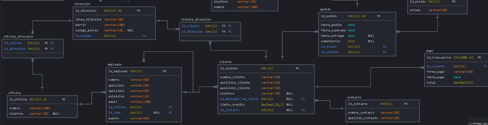

# Proyecto Base De Datos

1. Archivo sql con la estructura de la base de datos:




2. DDL / Creacion de la base de datos:

```mysql

CREATE DATABASE proyecto;
Query OK, 1 row affected (0.07 sec)

SHOW DATABASES;
+--------------------+
| Database           |
+--------------------+
| information_schema |
| mysql              |
| normalizacion      |
| performance_schema |
| proyecto           |
| sys                |
| work               |
+--------------------+
7 rows in set (0.00 sec)
```


**Consultas sobre una tabla**

1. Devuelve un listado con el código de oficina y la ciudad donde hay oficinas.

```mysql
SELECT oficina.id_oficina, c.nombre as Ciudad
FROM oficina_direccion as oficina 
RIGHT JOIN direccion as d ON d.id_ciudad = oficina.id_direccion 
INNER JOIN ciudad as c ON c.id_ciudad = d.id_ciudad
WHERE oficina.id_oficina IS NOT NULL;

+------------+-----------+
| id_oficina | Ciudad    |
+------------+-----------+
|          1 | Madrid    |
|          2 | Barcelona |
|          3 | París     |
|          4 | Milán     |
|          5 | Múnich    |
+------------+-----------+
5 rows in set (0.00 sec)
   ```

2. Devuelve un listado con la ciudad y el teléfono de las oficinas de España.

```mysql
SELECT ofidi.id_oficina, c.nombre, ofi.telefono 
FROM oficina_direccion ofidi JOIN direccion as d ON d.id_ciudad = ofidi.id_direccion 
INNER JOIN ciudad as c ON c.id_ciudad = d.id_ciudad  
JOIN oficina as ofi ON ofi.id_oficina = ofidi.id_oficina
JOIN region as rg ON rg.id_region = c.id_region
JOIN pais pa  ON rg.id_pais = pa.id_pais
WHERE pa.nombre = 'España';

+------------+-----------+-----------+
| id_oficina | nombre    | telefono  |
+------------+-----------+-----------+
|          1 | Madrid    | 123456789 |
|          2 | Barcelona | 987654321 |
+------------+-----------+-----------+
2 rows in set (0.00 sec)
  ```

3. Devuelve un listado con el nombre, apellidos y email de los empleados cuyo jefe tiene un código de jefe igual a 7.

```mysql
SELECT nombre, apellido1, apellido2, email
FROM empleado
WHERE id_jefe = 7;

Empty set (0.00 sec)
  ```

4. Devuelve el nombre del puesto, nombre, apellidos y email del jefe de la
empresa.

```mysql
SELECT nombre, apellido1, apellido2, email
FROM empleado
WHERE puesto = "CEO";

+--------+-----------+-----------+----------------------+
| nombre | apellido1 | apellido2 | email                |
+--------+-----------+-----------+----------------------+
| John   | Doe       |           | john.doe@example.com |
+--------+-----------+-----------+----------------------+
1 row in set (0.00 sec)
  ```

5. Devuelve un listado con el nombre, apellidos y puesto de aquellos
empleados que no sean representantes de ventas.

```mysql
SELECT nombre, apellido1, apellido2, email
FROM empleado
WHERE puesto = "Representante de Ventas";

+---------+-----------+-----------+------------------------------+
| nombre  | apellido1 | apellido2 | email                        
+---------+-----------+-----------+------------------------------+
| David   | Martinez  |           | david.martinez@example.com   |
| Emma    | Garcia    |           | emma.garcia@example.com      |
| William | Lopez     |           | william.lopez@example.com    |
| Olivia  | Rodriguez |           | olivia.rodriguez@example.com |
+---------+-----------+-----------+------------------------------+
4 rows in set (0.00 sec)
  ```

6. Devuelve un listado con el nombre de los todos los clientes españoles.

```mysql
SELECT cliente.nombre_cliente
FROM cliente
JOIN cliente_direccion ON cliente.id_cliente = cliente_direccion.id_cliente
JOIN direccion ON cliente_direccion.id_direccion = direccion.id_direccion
JOIN ciudad ON direccion.id_ciudad = ciudad.id_ciudad
JOIN region ON ciudad.id_region = region.id_region
JOIN pais ON region.id_pais = pais.id_pais
WHERE pais.nombre = 'España';

+----------------+
| nombre_cliente |
+----------------+
| Juan           |
| Francisco      |
| María          |
+----------------+
3 rows in set (0.00 sec)
  ```

7. Devuelve un listado con los distintos estados por los que puede pasar un pedido.
   
```mysql
SELECT estado FROM estado_pedido;
+------------+
| estado     |
+------------+
| En proceso |
| En espera  |
| Completado |
| Cancelado  |
+------------+
4 rows in set (0.00 sec)
  ```

8. Devuelve un listado con el código de cliente de aquellos clientes que realizaron algún pago en 2008. Tenga en cuenta que deberá eliminar aquellos códigos de cliente que aparezcan repetidos. Resuelva la consulta:

- YEAR:
```mysql
SELECT DISTINCT id_cliente
FROM pago
WHERE YEAR(fecha_pago) = 2008;

+------------+
| id_cliente |
+------------+
|          7 |
|         11 |
+------------+
2 rows in set (0.00 sec)
  ```

- DATE_FORMAT:
```mysql
SELECT DISTINCT id_cliente
FROM pago
WHERE DATE_FORMAT(fecha_pago, '%Y') = '2008';

+------------+
| id_cliente |
+------------+
|          7 |
|         11 |
+------------+
2 rows in set (0.00 sec)
  ```

- Sin utilizar ninguna de las funciones anteriores:
```mysql
SELECT DISTINCT pago.id_cliente
FROM pago
JOIN cliente ON pago.id_cliente = cliente.id_cliente
WHERE fecha_pago >= '2008-01-01' AND fecha_pago <= '2008-12-31';

+------------+
| id_cliente |
+------------+
|          7 |
|         11 |
+------------+
2 rows in set (0.00 sec)
  ```

9. Devuelve un listado con el código de pedido, código de cliente, fecha
esperada y fecha de entrega de los pedidos que no han sido entregados a
tiempo.

```mysql
SELECT p.id_pedido, p.id_cliente, p.fecha_esperada, p.fecha_entrega
FROM pedido as p
JOIN estado_pedido as e ON e.id_estado = p.id_estado 
WHERE e.estado = "no entregado a tiempo";

+-----------+------------+----------------+---------------+
| id_pedido | id_cliente | fecha_esperada | fecha_entrega |
+-----------+------------+----------------+---------------+
|        20 |         20 | 2024-05-10     | 2024-05-10    |
+-----------+------------+----------------+---------------+
1 row in set (0.00 sec)
  ```

10. Devuelve un listado con el código de pedido, código de cliente, fecha
esperada y fecha de entrega de los pedidos cuya fecha de entrega ha sido al
menos dos días antes de la fecha esperada.

- ADDDATE
```mysql
SELECT id_pedido, id_cliente, fecha_esperada, fecha_entrega
FROM pedido
WHERE fecha_entrega <= ADDDATE(fecha_esperada, -2);

Empty set (0.00 sec)
  ```

- DATEDIFF
```mysql
SELECT id_pedido, id_cliente, fecha_esperada, fecha_entrega
FROM pedido
WHERE DATEDIFF(fecha_esperada, fecha_entrega) >= 2;

Empty set (0.00 sec)
  ```

- ¿Sería posible resolver esta consulta utilizando el operador de suma + o
resta -?

```mysql
SELECT id_pedido, id_cliente, fecha_esperada, fecha_entrega
FROM pedido
WHERE fecha_entrega <= fecha_esperada - INTERVAL 2 DAY;

Empty set (0.00 sec)
  ```

11. Devuelve un listado de todos los pedidos que fueron rechazados en 2009.

```mysql
SELECT p.id_pedido
FROM pedido as p
JOIN estado_pedido as e ON e.id_estado = p.id_estado 
WHERE e.estado = "Cancelado";

+-----------+
| id_pedido |
+-----------+
|         1 |
|         4 |
|         5 |
|         8 |
|        10 |
+-----------+
5 rows in set (0.00 sec)
  ```

12. Devuelve un listado de todos los pedidos que han sido entregados en el
mes de enero de cualquier año.


```mysql
SELECT p.id_pedido
FROM pedido as p
JOIN estado_pedido as e ON e.id_estado = p.id_estado 
WHERE e.estado = "Completado" AND MONTH(fecha_entrega) = 1;

+-----------+
| id_pedido |
+-----------+
|         2 |
+-----------+
1 row in set (0.00 sec)
  ```

13. Devuelve un listado con todos los pagos que se realizaron en el
año 2008 mediante Paypal. Ordene el resultado de mayor a menor.

```mysql
SELECT id_transaccion
FROM pago
WHERE forma_pago = 'Paypal' AND YEAR(fecha_pago) = 2008
ORDER BY total DESC;

+----------------+
| id_transaccion |
+----------------+
|              7 |
|             11 |
+----------------+
2 rows in set (0.02 sec)
  ```

14. Devuelve un listado con todas las formas de pago que aparecen en la
tabla pago. Tenga en cuenta que no deben aparecer formas de pago
repetidas.

```mysql

SELECT DISTINCT forma_pago
FROM pago;

+------------------------+
| forma_pago             |
+------------------------+
| Efectivo               |
| Tarjeta de crédito     |
| Transferencia bancaria |
| Cheque                 |
| PayPal                 |
+------------------------+
5 rows in set (0.02 sec)
  ```

15. Devuelve un listado con todos los productos que pertenecen a la
gama Ornamentales y que tienen más de 100 unidades en stock. El listado
deberá estar ordenado por su precio de venta, mostrando en primer lugar
los de mayor precio.

```mysql
SELECT p.id_producto, p.nombre, p.precio_venta, i.cantidad_en_stock
FROM producto p
JOIN inventario i ON p.id_producto = i.id_producto
JOIN gama_producto g ON p.id_gama = g.id_gama
WHERE g.gama = 'Ornamentales' AND i.cantidad_en_stock > 100
ORDER BY p.precio_venta DESC;

+-------------+---------+--------------+-------------------+
| id_producto | nombre  | precio_venta | cantidad_en_stock |
+-------------+---------+--------------+-------------------+
|           6 | Florero |     29.99000 |               200 |
+-------------+---------+--------------+-------------------+
1 row in set (0.00 sec)
  ```

16. Devuelve un listado con todos los clientes que sean de la ciudad de Madrid y cuyo representante de ventas tenga el código de empleado 11 o 30.

```mysql
SELECT c.id_cliente, c.nombre_cliente, c.apellido1_cliente, ciu.nombre as ciudad
FROM cliente AS c
JOIN cliente_direccion AS clidi ON clidi.id_cliente = c.id_cliente
JOIN direccion AS d ON d.id_direccion = clidi.id_direccion
JOIN ciudad AS ciu ON ciu.id_ciudad = d.id_ciudad
WHERE ciu.nombre = 'Madrid'
AND c.id_empleado_rep_ventas = 11 OR  c.id_empleado_rep_ventas = 30;

+------------+----------------+-------------------+--------+
| id_cliente | nombre_cliente | apellido1_cliente | ciudad |
+------------+----------------+-------------------+--------+
|          1 | Juan           | Pérez             | Madrid |
+------------+----------------+-------------------+--------+
1 row in set (0.00 sec)
  ```


**Consultas multitabla (Composición interna)**

Resuelva todas las consultas utilizando la sintaxis de SQL1 y SQL2. Las consultas con sintaxis de SQL2 se deben resolver con INNER JOIN y NATURAL JOIN.

1. Obtén un listado con el nombre de cada cliente y el nombre y apellido de su representante de ventas.

```mysql
- SQL1
SELECT cliente.nombre_cliente, empleado.nombre, empleado.apellido1
FROM cliente, empleado
WHERE cliente.id_empleado_rep_ventas = empleado.id_empleado;

- SQL2
SELECT c.nombre_cliente, e.nombre
FROM cliente as c
INNER JOIN empleado as e ON e.id_empleado = c.id_empleado_rep_ventas;

+----------------+-----------+-----------+
| nombre_cliente | nombre    | apellido1 |
+----------------+-----------+-----------+
| Lucía          | John      | Doe       |
| Daniel         | Jane      | Smith     |
| Isabel         | Michael   | Johnson   |
| Francisco      | Emily     | Brown     |
| María          | Emma      | Garcia    |
| Alberto        | Emma      | Garcia    |
| José           | William   | Lopez     |
| Silvia         | William   | Lopez     |
| Ana            | Olivia    | Rodriguez |
| Javier         | Olivia    | Rodriguez |
| Carlos         | Noah      | Hernandez |
| Rosa           | Noah      | Hernandez |
| Laura          | Ava       | Gonzalez  |
| Manuel         | Ava       | Gonzalez  |
| Juan           | James     | Perez     |
| Pedro          | James     | Perez     |
| Sara           | Isabella  | Torres    |
| Miguel         | Alexander | Rivera    |
| Carmen         | Sophia    | Flores    |
| Elena          | Mia       | Sanchez   |
+----------------+-----------+-----------+
20 rows in set (0.01 sec)
  ```

2. Muestra el nombre de los clientes que hayan realizado pagos junto con el nombre de sus representantes de ventas.

```mysql
- SQL1
SELECT c.nombre_cliente, e.nombre as nombre_empleado
FROM cliente c, empleado e, pago p
WHERE c.id_empleado_rep_ventas = e.id_empleado AND p.id_cliente = c.id_cliente;

- SQL2
SELECT c.nombre_cliente, e.nombre as nombre_empleado
FROM cliente AS c
JOIN empleado AS e ON c.id_empleado_rep_ventas = e.id_empleado
JOIN pago AS p ON p.id_cliente = c.id_cliente;

+----------------+-----------------+
| nombre_cliente | nombre_empleado |
+----------------+-----------------+
| Lucía          | John            |
| Daniel         | Jane            |
| Isabel         | Michael         |
| Francisco      | Emily           |
| María          | Emma            |
| Alberto        | Emma            |
| José           | William         |
| Silvia         | William         |
| Ana            | Olivia          |
| Javier         | Olivia          |
| Carlos         | Noah            |
| Rosa           | Noah            |
| Laura          | Ava             |
| Manuel         | Ava             |
| Juan           | James           |
| Pedro          | James           |
| Sara           | Isabella        |
| Miguel         | Alexander       |
| Carmen         | Sophia          |
| Elena          | Mia             |
+----------------+-----------------+
20 rows in set (0.00 sec)
  ```

3. Muestra el nombre de los clientes que no hayan realizado pagos junto con
el nombre de sus representantes de ventas.

```mysql
- SQL1
SELECT c.nombre_cliente, e.nombre AS nombre_empleado
FROM cliente c, empleado e
WHERE c.id_empleado_rep_ventas = e.id_empleado
AND c.id_cliente NOT IN (SELECT id_cliente FROM pago);


- SQL2
SELECT c.nombre_cliente, e.nombre
FROM cliente AS c
JOIN empleado AS e ON c.id_empleado_rep_ventas = e.id_empleado
JOIN pago AS p ON p.id_cliente = c.id_cliente
WHERE  c.id_cliente NOT IN (SELECT id_cliente FROM pago) ;

Empty set (0.00 sec)
  ```

4. Devuelve el nombre de los clientes que han hecho pagos y el nombre de sus representantes junto con la ciudad de la oficina a la que pertenece el
representante.

```mysql
- SQL1
SELECT  c.nombre_cliente, e.nombre as nombre_empleado, ciu.nombre 
FROM cliente AS c,  empleado AS e, oficina AS o,  oficina_direccion AS od,  direccion AS d,
ciudad AS ciu
WHERE c.id_empleado_rep_ventas = e.id_empleado 
AND o.id_oficina = e.id_oficina
AND  od.id_oficina = o.id_oficina
AND d.id_direccion = od.id_direccion
AND ciu.id_ciudad = d.id_ciudad
AND c.id_cliente IN (SELECT p.id_cliente FROM pago as p);

- SQL2
SELECT c.nombre_cliente, e.nombre as nombre_empleado, ciu.nombre 
FROM cliente AS c
JOIN empleado AS e ON c.id_empleado_rep_ventas = e.id_empleado
JOIN oficina AS o ON o.id_oficina = e.id_oficina
JOIN oficina_direccion AS od ON od.id_oficina = o.id_oficina
JOIN direccion AS d ON d.id_direccion = od.id_direccion
JOIN ciudad AS ciu ON ciu.id_ciudad = d.id_ciudad
WHERE  c.id_cliente IN (SELECT p.id_cliente FROM pago as p);

+----------------+-----------------+-----------+
| nombre_cliente | nombre_empleado | nombre    |
+----------------+-----------------+-----------+
| Lucía          | John            | Madrid    |
| Daniel         | Jane            | Madrid    |
| Isabel         | Michael         | Madrid    |
| Francisco      | Emily           | Barcelona |
| María          | Emma            | Barcelona |
| Alberto        | Emma            | Barcelona |
| José           | William         | Barcelona |
| Silvia         | William         | Barcelona |
| Ana            | Olivia          | Barcelona |
| Javier         | Olivia          | Barcelona |
| Carlos         | Noah            | París     |
| Rosa           | Noah            | París     |
| Laura          | Ava             | París     |
| Manuel         | Ava             | París     |
| Juan           | James           | París     |
| Pedro          | James           | París     |
| Sara           | Isabella        | Milán     |
| Miguel         | Alexander       | Milán     |
| Carmen         | Sophia          | Milán     |
| Elena          | Mia             | Múnich    |
+----------------+-----------------+-----------+
20 rows in set (0.00 sec)
  ```

5. Devuelve el nombre de los clientes que no hayan hecho pagos y el nombre
de sus representantes junto con la ciudad de la oficina a la que pertenece el representante.

```mysql
- SQL1
SELECT  c.nombre_cliente, e.nombre as nombre_empleado, ciu.nombre 
FROM cliente AS c,  empleado AS e, oficina AS o,  oficina_direccion AS od,  direccion AS d,
ciudad AS ciu
WHERE c.id_empleado_rep_ventas = e.id_empleado 
AND o.id_oficina = e.id_oficina
AND  od.id_oficina = o.id_oficina
AND d.id_direccion = od.id_direccion
AND ciu.id_ciudad = d.id_ciudad
AND c.id_cliente NOT IN (SELECT id_cliente FROM pago);

- SQL2
SELECT c.nombre_cliente, e.nombre as nombre_empleado, ciu.nombre 
FROM cliente AS c
JOIN empleado AS e ON c.id_empleado_rep_ventas = e.id_empleado
JOIN oficina AS o ON o.id_oficina = e.id_oficina
JOIN oficina_direccion AS od ON od.id_oficina = o.id_oficina
JOIN direccion AS d ON d.id_direccion = od.id_direccion
JOIN ciudad AS ciu ON ciu.id_ciudad = d.id_ciudad
WHERE  c.id_cliente NOT IN (SELECT p.id_cliente FROM pago as p);

Empty set (0.01 sec)
  ```

6. Lista la dirección de las oficinas que tengan clientes en Fuenlabrada.

```mysql
- SQL1
SELECT DISTINCT d.linea_direccion, d.barrio, d.codigo_postal
FROM cliente c, cliente_direccion cd, direccion d, ciudad ci
WHERE c.id_cliente = cd.id_cliente 
AND cd.id_direccion = d.id_direccion 
AND d.id_ciudad = ci.id_ciudad
AND ci.nombre = 'Fuenlabrada';

- SQL2
SELECT DISTINCT d.linea_direccion, d.barrio, d.codigo_postal
FROM cliente c
INNER JOIN cliente_direccion cd ON c.id_cliente = cd.id_cliente 
INNER JOIN direccion d ON cd.id_direccion = d.id_direccion 
INNER JOIN ciudad ci ON d.id_ciudad = ci.id_ciudad
WHERE ci.nombre = 'Fuenlabrada';

Empty set (0.00 sec)
  ```

7. Devuelve el nombre de los clientes y el nombre de sus representantes junto con la ciudad de la oficina a la que pertenece el representante.

```mysql
- SQL1
SELECT  c.nombre_cliente, e.nombre as nombre_empleado, ciu.nombre 
FROM cliente AS c,  empleado AS e, oficina AS o,  oficina_direccion AS od,  direccion AS d,
ciudad AS ciu
WHERE c.id_empleado_rep_ventas = e.id_empleado 
AND o.id_oficina = e.id_oficina
AND  od.id_oficina = o.id_oficina
AND d.id_direccion = od.id_direccion
AND ciu.id_ciudad = d.id_ciudad;

- SQL2
SELECT c.nombre_cliente, e.nombre as nombre_empleado, ciu.nombre 
FROM cliente AS c
JOIN empleado AS e ON c.id_empleado_rep_ventas = e.id_empleado
JOIN oficina AS o ON o.id_oficina = e.id_oficina
JOIN oficina_direccion AS od ON od.id_oficina = o.id_oficina
JOIN direccion AS d ON d.id_direccion = od.id_direccion
JOIN ciudad AS ciu ON ciu.id_ciudad = d.id_ciudad;

+----------------+-----------------+-----------+
| nombre_cliente | nombre_empleado | nombre    |
+----------------+-----------------+-----------+
| Lucía          | John            | Madrid    |
| Daniel         | Jane            | Madrid    |
| Isabel         | Michael         | Madrid    |
| Francisco      | Emily           | Barcelona |
| María          | Emma            | Barcelona |
| Alberto        | Emma            | Barcelona |
| José           | William         | Barcelona |
| Silvia         | William         | Barcelona |
| Ana            | Olivia          | Barcelona |
| Javier         | Olivia          | Barcelona |
| Carlos         | Noah            | París     |
| Rosa           | Noah            | París     |
| Laura          | Ava             | París     |
| Manuel         | Ava             | París     |
| Juan           | James           | París     |
| Pedro          | James           | París     |
| Sara           | Isabella        | Milán     |
| Miguel         | Alexander       | Milán     |
| Carmen         | Sophia          | Milán     |
| Elena          | Mia             | Múnich    |
+----------------+-----------------+-----------+
20 rows in set (0.00 sec)
  ```

8. Devuelve un listado con el nombre de los empleados junto con el nombre
de sus jefes.

```mysql

- SQL1
SELECT e1.nombre AS nombre_empleado, e2.nombre AS nombre_jefe
FROM empleado e1, empleado e2
WHERE e1.id_jefe = e2.id_empleado;

- SQL2
SELECT e1.nombre AS nombre_empleado, e2.nombre AS nombre_jefe
FROM empleado e1
INNER JOIN empleado e2 ON e1.id_jefe = e2.id_empleado;

+-----------------+-------------+
| nombre_empleado | nombre_jefe |
+-----------------+-------------+
| Jane            | John        |
| Michael         | John        |
| Emily           | John        |
| David           | Emily       |
| Emma            | Emily       |
| William         | Emily       |
| Olivia          | Emily       |
| Noah            | John        |
| Ava             | Noah        |
| James           | Noah        |
| Isabella        | John        |
| Alexander       | Isabella    |
| Sophia          | Isabella    |
| Mia             | John        |
+-----------------+-------------+
14 rows in set (0.01 sec)
  ```

9. Devuelve un listado que muestre el nombre de cada empleados, el nombre
de su jefe y el nombre del jefe de sus jefe.

```mysql
- SQL1
SELECT e1.nombre AS nombre_empleado, e2.nombre AS nombre_jefe, e3.nombre AS nombre_jefe_del_jefe
FROM empleado e1, empleado e2, empleado e3
WHERE e1.id_jefe = e2.id_empleado
AND e2.id_jefe = e3.id_empleado;

- SQL2
SELECT e1.nombre AS nombre_empleado, e2.nombre AS nombre_jefe, e3.nombre AS nombre_jefe_del_jefe
FROM empleado e1
INNER JOIN empleado e2 ON e1.id_jefe = e2.id_empleado
INNER JOIN empleado e3 ON e2.id_jefe = e3.id_empleado;

+-----------------+-------------+----------------------+
| nombre_empleado | nombre_jefe | nombre_jefe_del_jefe |
+-----------------+-------------+----------------------+
| David           | Emily       | John                 |
| Emma            | Emily       | John                 |
| William         | Emily       | John                 |
| Olivia          | Emily       | John                 |
| Ava             | Noah        | John                 |
| James           | Noah        | John                 |
| Alexander       | Isabella    | John                 |
| Sophia          | Isabella    | John                 |
+-----------------+-------------+----------------------+
8 rows in set (0.00 sec)
 ```

10. Devuelve el nombre de los clientes a los que no se les ha entregado a
tiempo un pedido.

 ```mysql
- SQL1
SELECT c.nombre_cliente
FROM cliente c, pedido p, estado_pedido e
WHERE p.id_cliente = c.id_cliente
AND p.id_estado = e.id_estado
AND e.estado = 'No entregado a tiempo';

- SQL2
SELECT  c.nombre_cliente
FROM  cliente c
INNER JOIN  pedido p ON p.id_cliente = c.id_cliente
INNER JOIN estado_pedido e ON p.id_estado = e.id_estado
WHERE e.estado = 'No entregado a tiempo';

+----------------+
| nombre_cliente |
+----------------+
| Alberto        |
+----------------+
1 row in set (0.00 sec)
 ```

11. Devuelve un listado de las diferentes gamas de producto que ha comprado cada cliente.

```mysql
- SQL1
SELECT c.nombre_cliente, gp.gama
FROM cliente c, pedido p, detalle_pedido dp, producto pr, gama_producto gp
WHERE c.id_cliente = p.id_cliente
AND p.id_pedido = dp.id_pedido
AND dp.id_producto = pr.id_producto
AND pr.id_gama = gp.id_gama
GROUP BY c.nombre_cliente, gp.gama;

- SQL2
SELECT c.nombre_cliente, gp.gama
FROM cliente c
INNER JOIN pedido p ON c.id_cliente = p.id_cliente
INNER JOIN detalle_pedido dp ON p.id_pedido = dp.id_pedido
INNER JOIN producto pr ON dp.id_producto = pr.id_producto
INNER JOIN gama_producto gp ON pr.id_gama = gp.id_gama
GROUP BY c.nombre_cliente, gp.gama;

+----------------+--------------------+
| nombre_cliente | gama               |
+----------------+--------------------+
| Juan           | Electrodomésticos  |
| Pedro          | Electrodomésticos  |
| Isabel         | Electrodomésticos  |
| Silvia         | Electrodomésticos  |
| María          | Muebles            |
| Sara           | Muebles            |
| Daniel         | Muebles            |
| Alberto        | Muebles            |
| José           | Electrónica        |
| Miguel         | Electrónica        |
| Lucía          | Electrónica        |
| Ana            | Juguetes           |
| Carmen         | Juguetes           |
| Manuel         | Juguetes           |
| Carlos         | Ropa               |
| Elena          | Ropa               |
| Rosa           | Ropa               |
| Laura          | Ornamentales       |
| Francisco      | Ornamentales       |
| Javier         | Ornamentales       |
+----------------+--------------------+
20 rows in set (0.01 sec)
 ```


**Consultas multitabla (Composición externa)**

Resuelva todas las consultas utilizando las cláusulas LEFT JOIN, RIGHT JOIN, NATURAL LEFT JOIN y NATURAL RIGHT JOIN.

1. Devuelve un listado que muestre solamente los clientes que no han realizado ningún pago.

```mysql
- LEFT JOIN
SELECT c.nombre_cliente
FROM cliente c
LEFT JOIN pago p ON c.id_cliente = p.id_cliente
WHERE p.id_cliente IS NULL;

- RIGHT JOIN
SELECT c.nombre_cliente
FROM cliente c
RIGHT JOIN pago p ON c.id_cliente = p.id_cliente
WHERE c.id_cliente IS NULL;

Empty set (0.00 sec)
 ```

2. Devuelve un listado que muestre solamente los clientes que no han realizado ningún pedido.

```mysql
- LEFT JOIN
SELECT c.nombre_cliente
FROM cliente c
LEFT JOIN pedido p ON p.id_cliente = c.id_cliente
WHERE p.id_pedido IS NULL;

- RIGHT JOIN
SELECT c.nombre_cliente
FROM cliente c
RIGHT JOIN pedido p ON c.id_cliente = p.id_cliente
WHERE p.id_cliente IS NULL;

Empty set (0.00 sec)
 ```

3. Devuelve un listado que muestre los clientes que no han realizado ningún pago y los que no han realizado ningún pedido.

 ```myqsl
- LEFT JOIN
SELECT c.nombre_cliente
FROM cliente c
LEFT JOIN pedido p ON p.id_cliente = c.id_cliente
LEFT JOIN pago pa ON c.id_cliente = p.id_cliente
WHERE p.id_pedido IS NULL AND pa.id_cliente IS NULL ;

- RIGHT JOIN
SELECT c.nombre_cliente
FROM cliente c
RIGHT JOIN pedido p ON c.id_cliente = p.id_cliente}
RIGHT JOIN pago pa ON c.id_cliente = pa.id_cliente
WHERE p.id_cliente IS NULL AND pa.id_cliente IS NULL;

Empty set (0.00 sec)
 ```

4. Devuelve un listado que muestre solamente los empleados que no tienen una oficina asociada.

```mysql
- LEFT JOIN
SELECT e.id_empleado, e.nombre
FROM empleado e
LEFT JOIN oficina o ON e.id_oficina = o.id_oficina
WHERE o.id_oficina IS NULL;

- RIGHT JOIN
SELECT e.id_empleado, e.nombre
FROM empleado e
RIGHT JOIN oficina o ON e.id_oficina = o.id_oficina
WHERE e.id_empleado IS NULL;

Empty set (0.00 sec)
 ```

5. Devuelve un listado que muestre solamente los empleados que no tienen un cliente asociado.

```mysql
- LEFT JOIN
SELECT e.nombre
FROM empleado as e
LEFT JOIN cliente as c ON c.id_empleado_rep_ventas = e.id_empleado
WHERE e.id_empleado IS NULL;

- RIGHT JOIN
SELECT  e.nombre
FROM cliente as c
RIGHT JOIN empleado as e ON e.id_empleado = c.id_empleado_rep_ventas
WHERE e.id_empleado IS NULL;

Empty set (0.00 sec)
 ```

6. Devuelve un listado que muestre solamente los empleados que no tienen un cliente asociado junto con los datos de la oficina donde trabajan.

```mysql
- LEFT JOIN
SELECT e.nombre, o.id_oficina, o.nombre, o.telefono, d.linea_direccion
FROM empleado as e
LEFT JOIN oficina as o ON o.id_oficina = e.id_oficina
LEFT JOIN oficina_direccion as od ON od.id_oficina = o.id_oficina
LEFT JOIN direccion as d ON od.id_direccion = d.id_direccion
LEFT JOIN cliente as c ON c.id_empleado_rep_ventas = e.id_empleado
WHERE e.id_empleado IS NULL;

- RIGHT JOIN
SELECT  e.nombre, o.id_oficina, o.nombre, o.telefono, d.linea_direccion
FROM cliente as cli
RIGHT JOIN empleado as e ON e.id_empleado = cli.id_empleado_rep_ventas
RIGHT JOIN oficina as o ON o.id_oficina = e.id_oficina
RIGHT JOIN oficina_direccion as od ON od.id_oficina = o.id_oficina
RIGHT JOIN direccion as d ON od.id_direccion = d.id_direccion
RIGHT JOIN cliente as c ON c.id_empleado_rep_ventas = e.id_empleado
WHERE e.id_empleado IS NULL;

Empty set (0.00 sec)
 ```

7. Devuelve un listado que muestre los empleados que no tienen una oficina asociada y los que no tienen un cliente asociado.

```mysql
- LEFT JOIN
SELECT e.id_empleado, e.nombre, e.apellido1, e.apellido2
FROM empleado e
LEFT JOIN oficina o ON e.id_oficina = o.id_oficina
LEFT JOIN cliente c ON e.id_empleado = c.id_empleado_rep_ventas
WHERE o.id_oficina IS NULL AND c.id_empleado_rep_ventas IS NULL;

- RIGHT JOIN
SELECT e.id_empleado, e.nombre, e.apellido1, e.apellido2
FROM oficina o
RIGHT JOIN empleado e ON e.id_oficina = o.id_oficina
RIGHT JOIN cliente c ON e.id_empleado = c.id_empleado_rep_ventas
WHERE o.id_oficina IS NULL AND c.id_empleado_rep_ventas IS NULL;

Empty set (0.00 sec)
 ```

8. Devuelve un listado de los productos que nunca han aparecido en un pedido.

```mysql
- LEFT JOIN
SELECT p.id_producto, p.nombre
FROM producto p
LEFT JOIN detalle_pedido dp ON p.id_producto = dp.id_producto
WHERE dp.id_producto IS NULL;

- RIGHT JOIN
SELECT p.id_producto, p.nombre
FROM detalle_pedido dp
RIGHT JOIN producto p ON dp.id_producto = p.id_producto
WHERE dp.id_producto IS NULL;

Empty set (0.00 sec)
 ```

9. Devuelve un listado de los productos que nunca han aparecido en un pedido. El resultado debe mostrar el nombre, la descripción y la imagen del producto.

```mysql
- LEFT JOIN
SELECT p.nombre, p.descripcion, p.imagen
FROM detalle_pedido dp
LEFT JOIN producto p ON p.id_producto = dp.id_producto
WHERE dp.id_producto IS NULL;

- RIGHT JOIN
SELECT p.nombre, p.descripcion, p.imagen
FROM producto p
RIGHT JOIN detalle_pedido dp ON p.id_producto = dp.id_producto
WHERE dp.id_producto IS NULL;

Empty set (0.00 sec)
 ```

10. Devuelve las oficinas donde no trabajan ninguno de los empleados que hayan sido los representantes de ventas de algún cliente que haya realizado
la compra de algún producto de la gama Frutales.

 ```mysql
- LEFT JOIN
SELECT DISTINCT o.id_oficina, o.nombre
FROM oficina o
LEFT JOIN empleado e ON o.id_oficina = e.id_oficina
LEFT JOIN cliente c ON e.id_empleado = c.id_empleado_rep_ventas
LEFT JOIN pedido pe ON c.id_cliente = pe.id_cliente
LEFT JOIN detalle_pedido dp ON pe.id_pedido = dp.id_pedido
LEFT JOIN producto p ON dp.id_producto = p.id_producto
LEFT JOIN gama_producto gp ON p.id_gama = gp.id_gama
WHERE gp.gama != 'Frutales' OR gp.gama IS NULL;

- RIGHT JOIN
SELECT DISTINCT o.id_oficina, o.nombre
FROM empleado e
RIGHT JOIN oficina o ON e.id_oficina = o.id_oficina
RIGHT JOIN cliente c ON e.id_empleado = c.id_empleado_rep_ventas
RIGHT JOIN pedido pe ON c.id_cliente = pe.id_cliente
RIGHT JOIN detalle_pedido dp ON pe.id_pedido = dp.id_pedido
RIGHT JOIN producto p ON dp.id_producto = p.id_producto
RIGHT JOIN gama_producto gp ON p.id_gama = gp.id_gama
WHERE gp.gama != 'Frutales' OR gp.gama IS NULL;

Empty set (0.00 sec)
 ```

11. Devuelve un listado con los clientes que han realizado algún pedido pero no han realizado ningún pago.

```mysql
- LEFT JOIN
SELECT c.id_cliente, c.nombre_cliente
FROM cliente c
LEFT JOIN pedido pe ON c.id_cliente = pe.id_cliente
LEFT JOIN pago pa ON c.id_cliente = pa.id_cliente
WHERE pe.id_pedido IS NOT NULL AND pa.id_transaccion IS NULL;

- RIGHT JOIN
SELECT c.id_cliente, c.nombre_cliente
FROM pedido pe
RIGHT JOIN cliente c ON pe.id_cliente = c.id_cliente
LEFT JOIN pago pa ON c.id_cliente = pa.id_cliente
WHERE pa.id_transaccion IS NULL;

Empty set (0.00 sec)
 ```

12. Devuelve un listado con los datos de los empleados que no tienen clientes asociados y el nombre de su jefe asociado.

```mysql
- LEFT JOIN
SELECT e.id_empleado, e.nombre, e.apellido1, e.apellido2, e.extension, e.email, e.id_oficina, e.id_jefe, j.nombre AS nombre_jefe
FROM empleado e
LEFT JOIN empleado j ON e.id_jefe = j.id_empleado
LEFT JOIN cliente c ON e.id_empleado = c.id_empleado_rep_ventas
WHERE c.id_cliente IS NULL;

- RIGHT JOIN
SELECT e.id_empleado, e.nombre, e.apellido1, e.apellido2, e.extension, e.email, e.id_oficina, e.id_jefe,
j.nombre AS nombre_jefe
FROM cliente c
RIGHT JOIN empleado e ON c.id_empleado_rep_ventas = e.id_empleado
LEFT JOIN empleado j ON e.id_jefe = j.id_empleado
WHERE c.id_cliente IS NULL;

Empty set (0.00 sec)
 ```


**Consultas resumen**

1. ¿Cuántos empleados hay en la compañía?

```mysql
SELECT COUNT(id_empleado)
FROM empleado;

+--------------------+
| COUNT(id_empleado) |
+--------------------+
|                 15 |
+--------------------+
1 row in set (0.01 sec)
 ```

2. ¿Cuántos clientes tiene cada país?

 ```mysql
SELECT p.nombre AS nombre_pais, COUNT(DISTINCT c.id_cliente) AS cantidad_clientes
FROM cliente c
LEFT JOIN cliente_direccion cd ON c.id_cliente = cd.id_cliente
LEFT JOIN direccion d ON cd.id_direccion = d.id_direccion
LEFT JOIN ciudad ciu ON d.id_ciudad = ciu.id_ciudad
LEFT JOIN region r ON ciu.id_region = r.id_region
LEFT JOIN pais p ON r.id_pais = p.id_pais
GROUP BY p.nombre;

+----------------+-------------------+
| nombre_pais    | cantidad_clientes |
+----------------+-------------------+
| Alemania       |                 2 |
| Brasil         |                 1 |
| China          |                 2 |
| España         |                 3 |
| Estados Unidos |                 2 |
| Francia        |                 2 |
| Italia         |                 2 |
| Japón          |                 2 |
| Portugal       |                 2 |
| Reino Unido    |                 2 |
+----------------+-------------------+
10 rows in set (0.01 sec)
 ```

3. ¿Cuál fue el pago medio en 2009?

```mysql
SELECT AVG(total) AS pago_medio_2009
FROM pago
WHERE YEAR(fecha_pago) = 2009;

+-----------------+
| pago_medio_2009 |
+-----------------+
|            NULL |
+-----------------+
1 row in set (0.00 sec)
 ```

4. ¿Cuántos pedidos hay en cada estado? Ordena el resultado de forma
descendente por el número de pedidos.

```mysql
SELECT r.nombre AS region, COUNT(p.id_pedido) AS cantidad_pedidos
FROM pedido p
JOIN cliente c ON p.id_cliente = c.id_cliente
JOIN cliente_direccion cd ON c.id_cliente = cd.id_cliente
JOIN direccion d ON cd.id_direccion = d.id_direccion
JOIN ciudad ci ON d.id_ciudad = ci.id_ciudad
JOIN region r ON ci.id_region = r.id_region
GROUP BY r.nombre
ORDER BY cantidad_pedidos DESC;

+----------------+------------------+
| region         | cantidad_pedidos |
+----------------+------------------+
| Madrid         |                2 |
| Île-de-France  |                2 |
| Lombardía      |                2 |
| Baviera        |                2 |
| Lisboa         |                2 |
| Londres        |                2 |
| California     |                2 |
| Shanghái       |                2 |
| Kantō          |                2 |
| Cataluña       |                1 |
| São Paulo      |                1 |
+----------------+------------------+
11 rows in set (0.00 sec)
 ```

5. Calcula el precio de venta del producto más caro y más barato en una
misma consulta.

```mysql
SELECT 
    MAX(precio_venta) AS precio_mas_caro,
    MIN(precio_venta) AS precio_mas_barato
FROM producto;

+-----------------+-------------------+
| precio_mas_caro | precio_mas_barato |
+-----------------+-------------------+
|       899.99000 |          24.99000 |
+-----------------+-------------------+
1 row in set (0.00 sec)
 ```

6. Calcula el número de clientes que tiene la empresa.

```mysql
SELECT COUNT(id_cliente)
FROM cliente;

+-------------------+
| COUNT(id_cliente) |
+-------------------+
|                20 |
+-------------------+
1 row in set (0.00 sec)
 ```

7. ¿Cuántos clientes existen con domicilio en la ciudad de Madrid?

```mysql
SELECT COUNT(DISTINCT c.id_cliente) AS total_clientes_madrid
FROM cliente c
JOIN cliente_direccion cd ON c.id_cliente = cd.id_cliente
JOIN direccion d ON cd.id_direccion = d.id_direccion
JOIN ciudad ci ON d.id_ciudad = ci.id_ciudad
WHERE ci.nombre = 'Madrid';

+-----------------------+
| total_clientes_madrid |
+-----------------------+
|                     2 |
+-----------------------+
1 row in set (0.00 sec)
 ```

8. ¿Calcula cuántos clientes tiene cada una de las ciudades que empiezan
por M?

```mysql
SELECT ci.nombre AS ciudad, COUNT(DISTINCT c.id_cliente) AS total_clientes
FROM cliente c
JOIN cliente_direccion cd ON c.id_cliente = cd.id_cliente
JOIN direccion d ON cd.id_direccion = d.id_direccion
JOIN ciudad ci ON d.id_ciudad = ci.id_ciudad
WHERE ci.nombre LIKE 'M%'
GROUP BY ci.nombre;

+---------+----------------+
| ciudad  | total_clientes |
+---------+----------------+
| Madrid  |              2 |
| Milán   |              2 |
| Múnich  |              2 |
+---------+----------------+
3 rows in set (0.00 sec)
 ```

9. Devuelve el nombre de los representantes de ventas y el número de clientes al que atiende cada uno.

```mysql
SELECT e.nombre AS representante_ventas, COUNT(DISTINCT c.id_cliente) AS numero_clientes
FROM empleado e
LEFT JOIN cliente c ON e.id_empleado = c.id_empleado_rep_ventas
GROUP BY e.nombre;

+----------------------+-----------------+
| representante_ventas | numero_clientes |
+----------------------+-----------------+
| Alexander            |               1 |
| Ava                  |               2 |
| David                |               0 |
| Emily                |               1 |
| Emma                 |               2 |
| Isabella             |               1 |
| James                |               2 |
| Jane                 |               1 |
| John                 |               1 |
| Mia                  |               1 |
| Michael              |               1 |
| Noah                 |               2 |
| Olivia               |               2 |
| Sophia               |               1 |
| William              |               2 |
+----------------------+-----------------+
15 rows in set (0.00 sec)
 ```

10. Calcula el número de clientes que no tiene asignado representante de
ventas.

```mysql
SELECT COUNT(id_cliente) AS clientes_sin_representante
FROM cliente
WHERE id_empleado_rep_ventas IS NULL;

+----------------------------+
| clientes_sin_representante |
+----------------------------+
|                          0 |
+----------------------------+
1 row in set (0.00 sec)
 ```

11. Calcula la fecha del primer y último pago realizado por cada uno de los clientes. El listado deberá mostrar el nombre y los apellidos de cada cliente.

```mysql
SELECT c.nombre_cliente, c.apellido1_cliente,
       MIN(p.fecha_pago) AS primer_pago,
       MAX(p.fecha_pago) AS ultimo_pago
FROM cliente c
LEFT JOIN pago p ON c.id_cliente = p.id_cliente
GROUP BY c.id_cliente, c.nombre_cliente, c.apellido1_cliente;

+----------------+-------------------+-------------+-------------+
| nombre_cliente | apellido1_cliente | primer_pago | ultimo_pago |
+----------------+-------------------+-------------+-------------+
| Juan           | Pérez             | 2022-05-01  | 2022-05-01  |
| María          | López             | 2024-05-02  | 2024-05-02  |
| José           | Martínez          | 2024-05-03  | 2024-05-03  |
| Ana            | Gómez             | 2020-01-04  | 2020-01-04  |
| Carlos         | Díaz              | 2022-05-05  | 2022-05-05  |
| Laura          | Ruiz              | 2024-05-06  | 2024-05-06  |
| Pedro          | Sánchez           | 2008-03-07  | 2008-03-07  |
| Sara           | Gutiérrez         | 2024-01-08  | 2024-01-08  |
| Miguel         | Torres            | 2024-05-09  | 2024-05-09  |
| Carmen         | Vázquez           | 2024-05-10  | 2024-05-10  |
| Elena          | Moreno            | 2008-01-11  | 2008-01-11  |
| Francisco      | Álvarez           | 2024-05-12  | 2024-05-12  |
| Isabel         | Jiménez           | 2021-05-13  | 2021-05-13  |
| Daniel         | Ortega            | 2014-05-14  | 2014-05-14  |
| Lucía          | Flores            | 2015-05-15  | 2015-05-15  |
| Manuel         | Romero            | 2024-05-16  | 2024-05-16  |
| Rosa           | Santos            | 2024-05-17  | 2024-05-17  |
| Javier         | Morales           | 2024-05-18  | 2024-05-18  |
| Silvia         | Iglesias          | 2024-05-19  | 2024-05-19  |
| Alberto        | Cruz              | 2024-05-20  | 2024-05-20  |
+----------------+-------------------+-------------+-------------+
20 rows in set (0.00 sec)
 ```

12. Calcula el número de productos diferentes que hay en cada uno de los
pedidos.

```mysql
SELECT id_pedido, COUNT(DISTINCT id_producto) AS num_productos_diferentes
FROM detalle_pedido
GROUP BY id_pedido;

+-----------+--------------------------+
| id_pedido | num_productos_diferentes |
+-----------+--------------------------+
|         1 |                        1 |
|         2 |                        1 |
|         3 |                        1 |
|         4 |                        1 |
|         5 |                        1 |
|         6 |                        1 |
|         7 |                        1 |
|         8 |                        1 |
|         9 |                        1 |
|        10 |                        1 |
|        11 |                        1 |
|        12 |                        1 |
|        13 |                        1 |
|        14 |                        1 |
|        15 |                        1 |
|        16 |                        1 |
|        17 |                        1 |
|        18 |                        1 |
|        19 |                        1 |
|        20 |                        1 |
+-----------+--------------------------+
20 rows in set (0.00 sec)
 ```

13. Calcula la suma de la cantidad total de todos los productos que aparecen en cada uno de los pedidos.

```mysql
SELECT id_pedido, SUM(cantidad) AS cantidad_total
FROM detalle_pedido
GROUP BY id_pedido;

+-----------+----------------+
| id_pedido | cantidad_total |
+-----------+----------------+
|         1 |              1 |
|         2 |              1 |
|         3 |              1 |
|         4 |              1 |
|         5 |              1 |
|         6 |              1 |
|         7 |              1 |
|         8 |              1 |
|         9 |              1 |
|        10 |              1 |
|        11 |              1 |
|        12 |              1 |
|        13 |              1 |
|        14 |              1 |
|        15 |              1 |
|        16 |              1 |
|        17 |              1 |
|        18 |              1 |
|        19 |              1 |
|        20 |              1 |
+-----------+----------------+
20 rows in set (0.00 sec)
 ```

14. Devuelve un listado de los 20 productos más vendidos y el número total de unidades que se han vendido de cada uno. El listado deberá estar ordenado por el número total de unidades vendidas.

```mysql
SELECT dp.id_producto, p.nombre AS nombre_producto, SUM(dp.cantidad) AS total_unidades_vendidas
FROM detalle_pedido dp
JOIN producto p ON dp.id_producto = p.id_producto
GROUP BY dp.id_producto, p.nombre
ORDER BY total_unidades_vendidas DESC
LIMIT 20;

+-------------+-----------------+-------------------------+
| id_producto | nombre_producto | total_unidades_vendidas |
+-------------+-----------------+-------------------------+
|           1 | Lavadora        |                       4 |
|           2 | Sofá            |                       4 |
|           3 | Televisor       |                       3 |
|           4 | Muñeca          |                       3 |
|           5 | Camiseta        |                       3 |
|           6 | Florero         |                       3 |
+-------------+-----------------+-------------------------+
6 rows in set (0.00 sec)
 ```

15. La facturación que ha tenido la empresa en toda la historia, indicando la base imponible, el IVA y el total facturado. La base imponible se calcula sumando el coste del producto por el número de unidades vendidas de la tabla detalle_pedido. El IVA es el 21 % de la base imponible, y el total la suma de los dos campos anteriores.

```mysql
SELECT 
    SUM(dp.precio_unidad * dp.cantidad) AS base_imponible,
    SUM(dp.precio_unidad * dp.cantidad) * 0.21 AS iva,
    SUM(dp.precio_unidad * dp.cantidad) + (SUM(dp.precio_unidad * dp.cantidad) * 0.21) AS total_facturado
FROM detalle_pedido dp;

+----------------+-----------+-----------------+
| base_imponible | iva       | total_facturado |
+----------------+-----------+-----------------+
|        7384.80 | 1550.8080 |       8935.6080 |
+----------------+-----------+-----------------+
1 row in set (0.00 sec)
 ```

16. La misma información que en la pregunta anterior, pero agrupada por código de producto.

```mysql
SELECT 
    dp.id_producto,
    p.nombre AS nombre_producto,
    SUM(dp.precio_unidad * dp.cantidad) AS base_imponible,
    SUM(dp.precio_unidad * dp.cantidad) * 0.21 AS iva,
    SUM(dp.precio_unidad * dp.cantidad) + (SUM(dp.precio_unidad * dp.cantidad) * 0.21) AS total_facturado
FROM detalle_pedido dp
JOIN producto p ON dp.id_producto = p.id_producto
GROUP BY dp.id_producto, p.nombre;

+-------------+-----------------+----------------+----------+-----------------+
| id_producto | nombre_producto | base_imponible | iva      | total_facturado |
+-------------+-----------------+----------------+----------+-----------------+
|           1 | Lavadora        |        2399.96 | 503.9916 |       2903.9516 |
|           2 | Sofá            |        1999.96 | 419.9916 |       2419.9516 |
|           3 | Televisor       |        2699.97 | 566.9937 |       3266.9637 |
|           4 | Muñeca          |         119.97 |  25.1937 |        145.1637 |
|           5 | Camiseta        |          74.97 |  15.7437 |         90.7137 |
|           6 | Florero         |          89.97 |  18.8937 |        108.8637 |
+-------------+-----------------+----------------+----------+-----------------+
6 rows in set (0.00 sec)
 ```

17. La misma información que en la pregunta anterior, pero agrupada por código de producto filtrada por los códigos que empiecen por OR.

```mysql
SELECT 
    dp.id_producto,
    p.nombre AS nombre_producto,
    SUM(dp.precio_unidad * dp.cantidad) AS base_imponible,
    SUM(dp.precio_unidad * dp.cantidad) * 0.21 AS iva,
    SUM(dp.precio_unidad * dp.cantidad) + (SUM(dp.precio_unidad * dp.cantidad) * 0.21) AS total_facturado
FROM detalle_pedido dp
JOIN producto p ON dp.id_producto = p.id_producto
WHERE p.nombre LIKE 'OR%'
GROUP BY dp.id_producto, p.nombre;

Empty set (0.00 sec)
 ```


18. Lista las ventas totales de los productos que hayan facturado más de 3000 euros. Se mostrará el nombre, unidades vendidas, total facturado y total facturado con impuestos (21% IVA).

```mysql
SELECT 
    p.nombre AS nombre_producto,
    SUM(dp.cantidad) AS unidades_vendidas,
    SUM(dp.precio_unidad * dp.cantidad) AS total_facturado_sin_iva,
    SUM(dp.precio_unidad * dp.cantidad) * 1.21 AS total_facturado_con_iva
FROM detalle_pedido dp
JOIN producto p ON dp.id_producto = p.id_producto
GROUP BY p.nombre
HAVING total_facturado_sin_iva > 3000;

Empty set (0.00 sec)
 ```

19. Muestre la suma total de todos los pagos que se realizaron para cada uno de los años que aparecen en la tabla pagos.

```mysql
SELECT 
    YEAR(fecha_pago) AS año,
    SUM(total) AS suma_total_pagos
FROM pago
GROUP BY YEAR(fecha_pago);

+------+------------------+
| año  | suma_total_pagos |
+------+------------------+
| 2022 |              625 |
| 2024 |             4095 |
| 2020 |               40 |
| 2008 |              625 |
| 2021 |              600 |
| 2014 |              500 |
| 2015 |              900 |
+------+------------------+
7 rows in set (0.00 sec)
 ```


**Subconsultas**
Con operadores básicos de comparación

1. Devuelve el nombre del cliente con mayor límite de crédito.
   
```mysql
SELECT nombre_cliente
FROM cliente
ORDER BY limite_credito DESC
LIMIT 1;

+----------------+
| nombre_cliente |
+----------------+
| Alberto        |
+----------------+
1 row in set (0.00 sec)
 ```
2. Devuelve el nombre del producto que tenga el precio de venta más caro.

```mysql
SELECT nombre
FROM producto
ORDER BY precio_venta DESC
LIMIT 1;

+-----------+
| nombre    |
+-----------+
| Televisor |
+-----------+
1 row in set (0.00 sec)
 ```

3. Devuelve el nombre del producto del que se han vendido más unidades.
(Tenga en cuenta que tendrá que calcular cuál es el número total de
unidades que se han vendido de cada producto a partir de los datos de la
tabla detalle_pedido)

```mysql
SELECT p.nombre
FROM producto p
JOIN detalle_pedido dp ON p.id_producto = dp.id_producto
GROUP BY p.id_producto
ORDER BY SUM(dp.cantidad) DESC
LIMIT 1;

+--------+
| nombre |
+--------+
| Sofá   |
+--------+
1 row in set (0.00 sec)
 ```

4. Los clientes cuyo límite de crédito sea mayor que los pagos que haya
realizado. (Sin utilizar INNER JOIN).

```mysql
SELECT nombre_cliente
FROM cliente
WHERE limite_credito > (
    SELECT SUM(total)
    FROM pago
    WHERE id_cliente = cliente.id_cliente
);

+----------------+
| nombre_cliente |
+----------------+
| Juan           |
| María          |
| José           |
| Ana            |
| Carlos         |
| Laura          |
| Pedro          |
| Sara           |
| Miguel         |
| Carmen         |
| Elena          |
| Francisco      |
| Isabel         |
| Daniel         |
| Lucía          |
| Manuel         |
| Rosa           |
| Javier         |
| Silvia         |
| Alberto        |
+----------------+
20 rows in set (0.00 sec)
 ```

5. Devuelve el producto que más unidades tiene en stock.
   
```mysql
SELECT p.nombre
FROM producto as p
JOIN inventario as i ON i.id_producto = p.id_producto
ORDER BY i.cantidad_en_stock DESC
LIMIT 1;

+----------+
| nombre   |
+----------+
| Camiseta |
+----------+
1 row in set (0.00 sec)
 ```

6. Devuelve el producto que menos unidades tiene en stock.
   
```mysql
SELECT p.nombre
FROM producto as p
JOIN inventario as i ON i.id_producto = p.id_producto
ORDER BY i.cantidad_en_stock ASC
LIMIT 1;

+----------+
| nombre   |
+----------+
| Lavadora |
+----------+
1 row in set (0.00 sec)
 ```

7. Devuelve el nombre, los apellidos y el email de los empleados que están a cargo de Alberto Soria.
   
```mysql
SELECT e.nombre, e.apellido1, e.apellido2, e.email
FROM empleado e
JOIN empleado jefe ON e.id_jefe = jefe.id_empleado
WHERE jefe.nombre = 'Alberto' AND jefe.apellido1 = 'Soria';

Empty set (0.00 sec)
 ```

Subconsultas con ALL y ANY

8. Devuelve el nombre del cliente con mayor límite de crédito.
   
```mysql
SELECT nombre_cliente
FROM cliente
WHERE limite_credito >= ALL (SELECT limite_credito FROM cliente);

+----------------+
| nombre_cliente |
+----------------+
| Alberto        |
+----------------+
1 row in set (0.00 sec)
 ```

9. Devuelve el nombre del producto que tenga el precio de venta más caro.

```mysql
SELECT nombre
FROM producto
WHERE precio_venta >= ALL (SELECT precio_venta FROM producto);

+-----------+
| nombre    |
+-----------+
| Televisor |
+-----------+
1 row in set (0.00 sec)
 ```

10. Devuelve el producto que menos unidades tiene en stock.
    
```mysql
SELECT p.nombre
FROM producto as p
JOIN detalle_pedido as d ON d.id_producto = p.id_producto
WHERE d.cantidad <= ALL (SELECT cantidad_en_stock FROM inventario);

+-----------+
| nombre    |
+-----------+
| Lavadora  |
| Sofá      |
| Televisor |
| Muñeca    |
| Camiseta  |
| Florero   |
+-----------+
6 rows in set (0.00 sec)
 ```


Subconsultas con IN y NOT IN

11. Devuelve el nombre, apellido1 y cargo de los empleados que no
representen a ningún cliente.

```mysql
SELECT nombre, apellido1, puesto
FROM empleado
WHERE id_empleado NOT IN (SELECT DISTINCT id_empleado_rep_ventas FROM cliente);

+--------+-----------+-------------------------+
| nombre | apellido1 | puesto                  |
+--------+-----------+-------------------------+
| David  | Martinez  | Representante de Ventas |
+--------+-----------+-------------------------+
1 row in set (0.00 sec)
 ```

12. Devuelve un listado que muestre solamente los clientes que no han
realizado ningún pago.

```mysql
SELECT *
FROM cliente
WHERE id_cliente NOT IN (SELECT id_cliente FROM pago);

Empty set (0.00 sec)
 ```

13. Devuelve un listado que muestre solamente los clientes que sí han realizado algún pago.
    
```mysql
SELECT *
FROM cliente
WHERE id_cliente IN (SELECT id_cliente FROM pago);

+------------+----------------+-------------------+-------------------+-----------+------------------------+----------------+-------------+
| id_cliente | nombre_cliente | apellido1_cliente | apellido2_cliente | telefono  | id_empleado_rep_ventas | limite_credito | id_contacto |
+------------+----------------+-------------------+-------------------+-----------+------------------------+----------------+-------------+
|          1 | Juan           | Pérez             | González          | 123456789 |                     11 |        5000.00 |           1 |
|          2 | María          | López             | García            | 987654321 |                      6 |        8000.00 |           2 |
|          3 | José           | Martínez          | Rodríguez         | 555555555 |                      7 |       10000.00 |           3 |
|          4 | Ana            | Gómez             | Fernández         | 444444444 |                      8 |       12000.00 |           4 |
|          5 | Carlos         | Díaz              | Hernández         | 333333333 |                      9 |       15000.00 |           5 |
|          6 | Laura          | Ruiz              | Jiménez           | 222222222 |                     10 |       20000.00 |           1 |
|          7 | Pedro          | Sánchez           | Pérez             | 111111111 |                     11 |       25000.00 |           2 |
|          8 | Sara           | Gutiérrez         | López             | 999999999 |                     12 |       30000.00 |           3 |
|          9 | Miguel         | Torres            | Martínez          | 888888888 |                     13 |       35000.00 |           4 |
|         10 | Carmen         | Vázquez           | Rodríguez         | 777777777 |                     14 |       40000.00 |           5 |
|         11 | Elena          | Moreno            | Martínez          | 666666666 |                     15 |       45000.00 |           1 |
|         12 | Francisco      | Álvarez           | Sánchez           | 555555555 |                      4 |       50000.00 |           2 |
|         13 | Isabel         | Jiménez           | Gutiérrez         | 444444444 |                      3 |       55000.00 |           3 |
|         14 | Daniel         | Ortega            | García            | 333333333 |                      2 |       60000.00 |           4 |
|         15 | Lucía          | Flores            | Rodríguez         | 222222222 |                      1 |       65000.00 |           5 |
|         16 | Manuel         | Romero            | Pérez             | 111111111 |                     10 |       70000.00 |           1 |
|         17 | Rosa           | Santos            | Hernández         | 999999999 |                      9 |       75000.00 |           2 |
|         18 | Javier         | Morales           | López             | 888888888 |                      8 |       80000.00 |           3 |
|         19 | Silvia         | Iglesias          | Martínez          | 777777777 |                      7 |       85000.00 |           4 |
|         20 | Alberto        | Cruz              | González          | 666666666 |                      6 |       90000.00 |           5 |
+------------+----------------+-------------------+-------------------+-----------+------------------------+----------------+-------------+
20 rows in set (0.01 sec)
 ```

14. Devuelve un listado de los productos que nunca han aparecido en un
pedido.

```mysql
SELECT *
FROM producto
WHERE id_producto NOT IN (SELECT id_producto FROM detalle_pedido);

Empty set (0.00 sec)
 ```

15. Devuelve el nombre, apellidos, puesto y teléfono de la oficina de aquellos empleados que no sean representante de ventas de ningún cliente.
    
```mysql
SELECT e.nombre, e.apellido1, e.apellido2, e.puesto, o.telefono
FROM empleado e
JOIN oficina o ON e.id_oficina = o.id_oficina
WHERE e.id_empleado NOT IN (SELECT DISTINCT id_empleado_rep_ventas FROM cliente WHERE id_empleado_rep_ventas IS NOT NULL);

+--------+-----------+-----------+-------------------------+-----------+
| nombre | apellido1 | apellido2 | puesto                  | telefono  |
+--------+-----------+-----------+-------------------------+-----------+
| David  | Martinez  |           | Representante de Ventas | 987654321 |
+--------+-----------+-----------+-------------------------+-----------+
1 row in set (0.00 sec)
 ```

16. Devuelve las oficinas donde no trabajan ninguno de los empleados que
hayan sido los representantes de ventas de algún cliente que haya realizado la compra de algún producto de la gama Frutales.

```mysql
SELECT *
FROM oficina
WHERE id_oficina NOT IN (SELECT DISTINCT id_oficina FROM empleado WHERE id_empleado IN (SELECT id_empleado_rep_ventas FROM cliente WHERE id_cliente IN (SELECT id_cliente FROM pedido WHERE id_gama IN (SELECT id_gama FROM gama_producto WHERE gama = 'Frutales'))));

Empty set (0.00 sec)
 ```

17. Devuelve un listado con los clientes que han realizado algún pedido pero no han realizado ningún pago.
    
```mysql
SELECT *
FROM cliente
WHERE id_cliente IN (SELECT id_cliente FROM pedido) AND id_cliente NOT IN (SELECT id_cliente FROM pago);

Empty set (0.00 sec)
 ```

Subconsultas con EXISTS y NOT EXISTS

18. Devuelve un listado que muestre solamente los clientes que no han
realizado ningún pago.

```mysql
SELECT *
FROM cliente c
WHERE NOT EXISTS (
    SELECT *
    FROM pago p
    WHERE p.id_cliente = c.id_cliente
);

Empty set (0.00 sec)
 ```

19. Devuelve un listado que muestre solamente los clientes que sí han realizado algún pago.

```mysql
SELECT *
FROM cliente c
WHERE EXISTS (
    SELECT *
    FROM pago p
    WHERE p.id_cliente = c.id_cliente
);

+------------+----------------+-------------------+-------------------+-----------+------------------------+----------------+-------------+
| id_cliente | nombre_cliente | apellido1_cliente | apellido2_cliente | telefono  | id_empleado_rep_ventas | limite_credito | id_contacto |
+------------+----------------+-------------------+-------------------+-----------+------------------------+----------------+-------------+
|          1 | Juan           | Pérez             | González          | 123456789 |                     11 |        5000.00 |           1 |
|          2 | María          | López             | García            | 987654321 |                      6 |        8000.00 |           2 |
|          3 | José           | Martínez          | Rodríguez         | 555555555 |                      7 |       10000.00 |           3 |
|          4 | Ana            | Gómez             | Fernández         | 444444444 |                      8 |       12000.00 |           4 |
|          5 | Carlos         | Díaz              | Hernández         | 333333333 |                      9 |       15000.00 |           5 |
|          6 | Laura          | Ruiz              | Jiménez           | 222222222 |                     10 |       20000.00 |           1 |
|          7 | Pedro          | Sánchez           | Pérez             | 111111111 |                     11 |       25000.00 |           2 |
|          8 | Sara           | Gutiérrez         | López             | 999999999 |                     12 |       30000.00 |           3 |
|          9 | Miguel         | Torres            | Martínez          | 888888888 |                     13 |       35000.00 |           4 |
|         10 | Carmen         | Vázquez           | Rodríguez         | 777777777 |                     14 |       40000.00 |           5 |
|         11 | Elena          | Moreno            | Martínez          | 666666666 |                     15 |       45000.00 |           1 |
|         12 | Francisco      | Álvarez           | Sánchez           | 555555555 |                      4 |       50000.00 |           2 |
|         13 | Isabel         | Jiménez           | Gutiérrez         | 444444444 |                      3 |       55000.00 |           3 |
|         14 | Daniel         | Ortega            | García            | 333333333 |                      2 |       60000.00 |           4 |
|         15 | Lucía          | Flores            | Rodríguez         | 222222222 |                      1 |       65000.00 |           5 |
|         16 | Manuel         | Romero            | Pérez             | 111111111 |                     10 |       70000.00 |           1 |
|         17 | Rosa           | Santos            | Hernández         | 999999999 |                      9 |       75000.00 |           2 |
|         18 | Javier         | Morales           | López             | 888888888 |                      8 |       80000.00 |           3 |
|         19 | Silvia         | Iglesias          | Martínez          | 777777777 |                      7 |       85000.00 |           4 |
|         20 | Alberto        | Cruz              | González          | 666666666 |                      6 |       90000.00 |           5 |
+------------+----------------+-------------------+-------------------+-----------+------------------------+----------------+-------------+
20 rows in set (0.00 sec)
 ```

20. Devuelve un listado de los productos que nunca han aparecido en un
pedido.

```mysql
SELECT *
FROM producto pr
WHERE NOT EXISTS (
    SELECT *
    FROM detalle_pedido dp
    WHERE dp.id_producto = pr.id_producto
);

Empty set (0.00 sec)
 ```

21. Devuelve un listado de los productos que han aparecido en un pedido
alguna vez.

```mysql
SELECT *
FROM producto pr
WHERE EXISTS (
    SELECT *
    FROM detalle_pedido dp
    WHERE dp.id_producto = pr.id_producto
);

+-------------+-----------+-----------------------------------------------------+------------------+--------------+----------------+--------------+---------+
| id_producto | nombre    | descripcion
               | precio_proveedor | precio_venta | id_dimensiones | id_proveedor | id_gama |
+-------------+-----------+-----------------------------------------------------+------------------+--------------+----------------+--------------+---------+
|           1 | Lavadora  | Lavadora de carga frontal con capacidad de 8 kg.    |        400.00000 |    599.99000 |              1 |            1 |       1 |
|           2 | Sofá      | Sofá de tres plazas con tapizado de tela.           |        300.00000 |    499.99000 |              2 |            2 |       2 |
|           3 | Televisor | Televisor LED de 55 pulgadas con resolución 4K.     |        600.00000 |    899.99000 |              3 |            3 |       3 |
|           4 | Muñeca    | Muñeca de porcelana con vestido de fiesta.          |         20.00000 |     39.99000 |              4 |            4 |       4 |
|           5 | Camiseta  | Camiseta de algodón con estampado de rayas.         |         10.00000 |     24.99000 |           NULL |         NULL |       5 |
|           6 | Florero   | Florero de cerámica decorado con motivos florales.  |         15.00000 |     29.99000 |              6 |         NULL |       6 |
+-------------+-----------+-----------------------------------------------------+------------------+--------------+----------------+--------------+---------+
6 rows in set (0.00 sec)
 ```

Subconsultas correlacionadas

Consultas variadas

1. Devuelve el listado de clientes indicando el nombre del cliente y cuántos pedidos ha realizado. Tenga en cuenta que pueden existir clientes que no han realizado ningún pedido.

```mysql
SELECT c.nombre_cliente, COUNT(p.id_pedido) AS pedidos_realizados
FROM cliente c
LEFT JOIN pedido p ON c.id_cliente = p.id_cliente
GROUP BY c.nombre_cliente;

+----------------+--------------------+
| nombre_cliente | pedidos_realizados |
+----------------+--------------------+
| Juan           |                  1 |
| María          |                  1 |
| José           |                  1 |
| Ana            |                  1 |
| Carlos         |                  1 |
| Laura          |                  1 |
| Pedro          |                  1 |
| Sara           |                  1 |
| Miguel         |                  1 |
| Carmen         |                  1 |
| Elena          |                  1 |
| Francisco      |                  1 |
| Isabel         |                  1 |
| Daniel         |                  1 |
| Lucía          |                  1 |
| Manuel         |                  1 |
| Rosa           |                  1 |
| Javier         |                  1 |
| Silvia         |                  1 |
| Alberto        |                  1 |
+----------------+--------------------+
20 rows in set (0.00 sec)
 ```

2. Devuelve un listado con los nombres de los clientes y el total pagado por cada uno de ellos. Tenga en cuenta que pueden existir clientes que no han realizado ningún pago.

```mysql
SELECT c.nombre_cliente, COALESCE(SUM(pa.total), 0) AS total_pagado
FROM cliente c
LEFT JOIN pago pa ON c.id_cliente = pa.id_cliente
GROUP BY c.nombre_cliente;

+----------------+--------------+
| nombre_cliente | total_pagado |
+----------------+--------------+
| Juan           |          600 |
| María          |          500 |
| José           |          900 |
| Ana            |           40 |
| Carlos         |           25 |
| Laura          |           30 |
| Pedro          |          600 |
| Sara           |          500 |
| Miguel         |          900 |
| Carmen         |           40 |
| Elena          |           25 |
| Francisco      |           30 |
| Isabel         |          600 |
| Daniel         |          500 |
| Lucía          |          900 |
| Manuel         |           40 |
| Rosa           |           25 |
| Javier         |           30 |
| Silvia         |          600 |
| Alberto        |          500 |
+----------------+--------------+
20 rows in set (0.00 sec)
 ```

3. Devuelve el nombre de los clientes que hayan hecho pedidos en 2008 ordenados alfabéticamente de menor a mayor.

```mysql
SELECT DISTINCT c.nombre_cliente
FROM cliente c
JOIN pedido p ON c.id_cliente = p.id_cliente
WHERE YEAR(p.fecha_pedido) = 2008
ORDER BY c.nombre_cliente ASC;

Empty set (0.00 sec)
 ```

4. Devuelve el nombre del cliente, el nombre y primer apellido de su representante de ventas y el número de teléfono de la oficina del representante de ventas, de aquellos clientes que no hayan realizado ningún pago.

```mysql
SELECT c.nombre_cliente, e.nombre AS nombre_empleado, e.apellido1 AS apellido_empleado, o.telefono
FROM cliente c
JOIN empleado e ON c.id_empleado_rep_ventas = e.id_empleado
JOIN oficina o ON e.id_oficina = o.id_oficina
LEFT JOIN pago p ON c.id_cliente = p.id_cliente
WHERE p.id_cliente IS NULL;

Empty set (0.00 sec)
 ```

5. Devuelve el listado de clientes donde aparezca el nombre del cliente, el nombre y primer apellido de su representante de ventas y la ciudad donde está su oficina.

```mysql
SELECT c.nombre_cliente, e.nombre AS nombre_empleado, e.apellido1 AS apellido_empleado, ciu.nombre AS ciudad_oficina
FROM cliente c
JOIN empleado e ON c.id_empleado_rep_ventas = e.id_empleado
JOIN oficina AS o ON o.id_oficina = e.id_oficina
JOIN oficina_direccion AS od ON od.id_oficina = o.id_oficina
JOIN direccion AS d ON d.id_direccion = od.id_direccion
JOIN ciudad AS ciu ON ciu.id_ciudad = d.id_ciudad;

+----------------+-----------------+-------------------+----------------+
| nombre_cliente | nombre_empleado | apellido_empleado | ciudad_oficina |
+----------------+-----------------+-------------------+----------------+
| Lucía          | John            | Doe               | Madrid         |
| Daniel         | Jane            | Smith             | Madrid         |
| Isabel         | Michael         | Johnson           | Madrid         |
| Francisco      | Emily           | Brown             | Barcelona      |
| María          | Emma            | Garcia            | Barcelona      |
| Alberto        | Emma            | Garcia            | Barcelona      |
| José           | William         | Lopez             | Barcelona      |
| Silvia         | William         | Lopez             | Barcelona      |
| Ana            | Olivia          | Rodriguez         | Barcelona      |
| Javier         | Olivia          | Rodriguez         | Barcelona      |
| Carlos         | Noah            | Hernandez         | París          |
| Rosa           | Noah            | Hernandez         | París          |
| Laura          | Ava             | Gonzalez          | París          |
| Manuel         | Ava             | Gonzalez          | París          |
| Juan           | James           | Perez             | París          |
| Pedro          | James           | Perez             | París          |
| Sara           | Isabella        | Torres            | Milán          |
| Miguel         | Alexander       | Rivera            | Milán          |
| Carmen         | Sophia          | Flores            | Milán          |
| Elena          | Mia             | Sanchez           | Múnich         |
+----------------+-----------------+-------------------+----------------+
20 rows in set (0.00 sec)
 ```

6. Devuelve el nombre, apellidos, puesto y teléfono de la oficina de aquellos empleados que no sean representante de ventas de ningún cliente.

```mysql
SELECT e.nombre, e.apellido1, e.puesto, o.telefono
FROM empleado e
JOIN oficina o ON e.id_oficina = o.id_oficina
WHERE e.id_empleado NOT IN (SELECT id_empleado_rep_ventas FROM cliente);

+--------+-----------+-------------------------+-----------+
| nombre | apellido1 | puesto                  | telefono  |
+--------+-----------+-------------------------+-----------+
| David  | Martinez  | Representante de Ventas | 987654321 |
+--------+-----------+-------------------------+-----------+
1 row in set (0.00 sec)
 ```

7. Devuelve un listado indicando todas las ciudades donde hay oficinas y el número de empleados que tiene.

```mysql
SELECT  ciu.nombre AS ciudad_oficina, COUNT(e.id_empleado) AS num_empleados
FROM empleado e
JOIN oficina AS o ON o.id_oficina = e.id_oficina
JOIN oficina_direccion AS od ON od.id_oficina = o.id_oficina
JOIN direccion AS d ON d.id_direccion = od.id_direccion
JOIN ciudad AS ciu ON ciu.id_ciudad = d.id_ciudad
GROUP BY ciu.nombre;

+----------------+---------------+
| ciudad_oficina | num_empleados |
+----------------+---------------+
| Madrid         |             3 |
| Barcelona      |             5 |
| París          |             3 |
| Milán          |             3 |
| Múnich         |             1 |
+----------------+---------------+
5 rows in set (0.00 sec)
 ```


-- PROCEDIMIENTOS 

1. Crear cliente:

```mysql
DELIMITER //
CREATE PROCEDURE sp_crear_cliente(
    IN nombre_cliente VARCHAR(50),
    IN apellido1_cliente VARCHAR(50),
    IN apellido2_cliente VARCHAR(50),
    IN telefono VARCHAR(20),
    IN id_empleado_rep_ventas INT,
    IN limite_credito DECIMAL(15,2),
    IN id_contacto INT
)
BEGIN
    INSERT INTO cliente (nombre_cliente, apellido1_cliente, apellido2_cliente, telefono, id_empleado_rep_ventas, limite_credito, id_contacto)
    VALUES (nombre_cliente, apellido1_cliente, apellido2_cliente, telefono, id_empleado_rep_ventas, limite_credito, id_contacto);
END //
DELIMITER ;
 ```

2. Actualizar cliente:

```mysql
DELIMITER //
CREATE PROCEDURE sp_actualizar_cliente(
    IN id_cliente INT,
    IN nombre_cliente VARCHAR(50),
    IN apellido1_cliente VARCHAR(50),
    IN apellido2_cliente VARCHAR(50),
    IN telefono VARCHAR(20),
    IN id_empleado_rep_ventas INT,
    IN limite_credito DECIMAL(15,2),
    IN id_contacto INT
)
BEGIN
    UPDATE cliente
    SET nombre_cliente = nombre_cliente, apellido1_cliente = apellido1_cliente, apellido2_cliente = apellido2_cliente,
        telefono = telefono, id_empleado_rep_ventas = id_empleado_rep_ventas, limite_credito = limite_credito, id_contacto = id_contacto
    WHERE id_cliente = id_cliente;
END //
DELIMITER ;
 ```

3. Eliminar cliente:

```mysql
DELIMITER //
CREATE PROCEDURE sp_eliminar_cliente(
    IN id_cliente INT
)
BEGIN
    DELETE FROM cliente WHERE id_cliente = id_cliente;
END //
DELIMITER ;
 ```

4. Buscar cliente por ID:

```mysql
DELIMITER //
CREATE PROCEDURE sp_buscar_cliente_por_id(
    IN id_cliente INT
)
BEGIN
    SELECT *
    FROM cliente
    WHERE id_cliente = id_cliente;
END //
DELIMITER ;
 ```

5. Crear pedido:

```mysql
DELIMITER //
CREATE PROCEDURE sp_crear_pedido(
    IN fecha_pedido DATE,
    IN fecha_esperada DATE,
    IN fecha_entrega DATE,
    IN comentarios TEXT,
    IN id_estado INT,
    IN id_cliente INT
)
BEGIN
    INSERT INTO pedido (fecha_pedido, fecha_esperada, fecha_entrega, comentarios, id_estado, id_cliente)
    VALUES (fecha_pedido, fecha_esperada, fecha_entrega, comentarios, id_estado, id_cliente);
END //
DELIMITER ;
 ```

6. Actualizar estado de pedido:

```mysql
DELIMITER //
CREATE PROCEDURE sp_actualizar_estado_pedido(
    IN id_pedido INT,
    IN id_estado INT
)
BEGIN
    UPDATE pedido
    SET id_estado = id_estado
    WHERE id_pedido = id_pedido;
END //
DELIMITER ;
 ```

7. Eliminar pedido:

```mysql
DELIMITER //
CREATE PROCEDURE sp_eliminar_pedido(
    IN id_pedido INT
)
BEGIN
    DELETE FROM pedido WHERE id_pedido = id_pedido;
END //
DELIMITER ;
 ```

8. Buscar pedido por ID:

```mysql
DELIMITER //
CREATE PROCEDURE sp_buscar_pedido_por_id(
    IN id_pedido INT
)
BEGIN
    SELECT *
    FROM pedido
    WHERE id_pedido = id_pedido;
END //
DELIMITER ;
 ```

9. Crear pago:

```mysql
DELIMITER //
CREATE PROCEDURE sp_crear_pago(
    IN id_cliente INT,
    IN forma_pago VARCHAR(40),
    IN fecha_pago DATE,
    IN total DECIMAL(15)
)
BEGIN
    INSERT INTO pago (id_cliente, forma_pago, fecha_pago, total)
    VALUES (id_cliente, forma_pago, fecha_pago, total);
END //
DELIMITER ;
 ```

10. Eliminar pago:
    
```mysql
DELIMITER //
CREATE PROCEDURE sp_eliminar_pago(
    IN id_transaccion INT
)
BEGIN
    DELETE FROM pago WHERE id_transaccion = id_transaccion;
END //
DELIMITER ;
 ```

-- VISTAS

1. Mostrar informacion basica de los clientes

```mysql
CREATE VIEW vista_clientes AS
SELECT id_cliente, nombre_cliente, telefono
FROM cliente;
 ```

2. Pagos realizados con tarjeta de crédito

```mysql
CREATE VIEW vista_pagos_tarjeta AS
SELECT id_transaccion, id_cliente, fecha_pago, total
FROM pago
WHERE forma_pago = 'tarjeta';
 ```

3. Productos con precios de venta superiores a 100

```mysql
CREATE VIEW vista_productos_caros AS
SELECT id_producto, nombre, precio_venta
FROM producto
WHERE precio_venta > 100;
 ```

4. Ciudades y sus respectivas regiones y países

```mysql
CREATE VIEW vista_ciudades_regiones_paises AS
SELECT c.nombre AS ciudad, r.nombre AS region, p.nombre AS pais
FROM ciudad c
JOIN region r ON c.id_region = r.id_region
JOIN pais p ON r.id_pais = p.id_pais;
 ```

5. Clientes que han realizado pedidos

```mysql
CREATE VIEW vista_clientes_pedidos AS
SELECT c.id_cliente, c.nombre_cliente, COUNT(p.id_pedido) AS num_pedidos
FROM cliente c
LEFT JOIN pedido p ON c.id_cliente = p.id_cliente
GROUP BY c.id_cliente;
 ```

6. Productos en stock

```mysql
CREATE VIEW vista_productos_stock AS
SELECT id_producto, nombre, cantidad_en_stock
FROM inventario;
 ```

7. Empleados y sus oficinas

```mysql
CREATE VIEW vista_empleados_oficinas AS
SELECT e.id_empleado, e.nombre, e.apellido1, e.apellido2, e.puesto, e.email, o.nombre AS nombre_oficina
FROM empleado e
JOIN oficina o ON e.id_oficina = o.id_oficina;
 ```

8. Pedidos entregados

```mysql
CREATE VIEW vista_pedidos_entregados AS
SELECT id_pedido, fecha_pedido, fecha_entrega, comentarios
FROM pedido
WHERE id_estado = 3;
 ```

9. Pagos realizados con efectivo

```mysql
CREATE VIEW vista_pagos_efectivo AS
SELECT id_transaccion, id_cliente, fecha_pago, total
FROM pago
WHERE forma_pago = 'efectivo';
 ```

10. Clientes y sus representantes de ventas
    
```mysql
CREATE VIEW vista_clientes_rep_ventas AS
SELECT c.id_cliente, c.nombre_cliente, c.apellido1_cliente, c.apellido2_cliente, e.nombre AS nombre_rep_ventas
FROM cliente c
LEFT JOIN empleado e ON c.id_empleado_rep_ventas = e.id_empleado;
 ```
